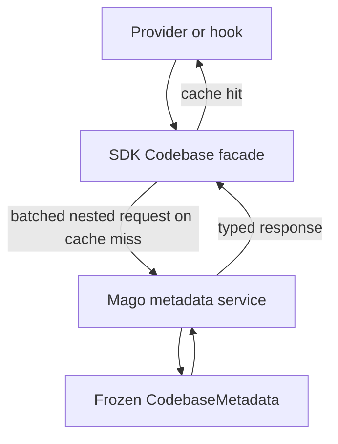

+++
title = "Codebase metadata"
description = "Query classes, callables, members, inheritance, and projected method metadata."
nav_order = 70
nav_section = "Extensions"
nav_subsection = "Analyzer"
+++
# Codebase metadata

Most analyzer callback contexts expose a read-only `Codebase` facade. It answers nested binary requests against Mago's merged native metadata and caches immutable responses for the current analysis generation.

Initialization and codebase-scan hook contracts do not expose this facade. Before-analysis hooks, providers, targeted hooks, after-file hooks, and after-analysis hooks receive the frozen codebase.



## Batch first

Every singular lookup is a convenience wrapper around a plural operation:

```php
use Acme\Domain\Organization;
use Acme\Domain\Team;
use Acme\Domain\User;

$user = $context->codebase->getClass(User::class);

$classes = $context->codebase->getMultipleClasses([
    User::class,
    Team::class,
    Organization::class,
]);
```

When several values are known together, always use `getMultiple*()` or `checkMultiple*Exist()`. One batch avoids several worker-to-Mago round trips. Results preserve input order and use `null` or `false` for missing symbols.

## Symbols and namespaces

Existence queries distinguish:

- classes, interfaces, traits, and enums;
- any class-like;
- class-or-trait and class-or-interface combinations;
- namespaces;
- global functions and constants.

Name-list methods are available for each class-like kind plus functions and constants. Full-list operations can be expensive on large projects; targeted lookups are preferable.

## Class-like metadata

Use `getClass()`, `getInterface()`, `getTrait()`, `getEnum()`, or `getClassLike()` when the expected kind matters. Their plural variants batch requests.

`ClassLikeMetadata` includes:

- normalized and source-cased names, kind, declaration locations, and flags;
- direct and transitive parents and interfaces;
- trait use, `require extends`, and `require implements` relationships;
- unresolved hierarchy dependencies and `hasIncompleteHierarchy()`;
- declared methods, pseudo-methods, properties, magic properties, constants, and enum cases;
- templates, attributes, type aliases, mixins, and enum backing type;
- optional children and permitted inheritors;
- sealed-method and sealed-property state and PHP version ranges.

Ancestry helpers return direct descendants, all descendants, or ancestors. Plural variants query multiple roots in one request.

`hasIncompleteHierarchy()` is true when Mago could not resolve a direct or transitive hierarchy dependency. The normalized missing names are available through `unresolvedHierarchyDependencies`. Local declarations and references discovered while analyzing their bodies remain available, but an extension should avoid negative conclusions that require complete inherited metadata.

## Functions and methods

Functions are queried by name. A `FunctionLikeIdentifier` can identify a function, method, or closure for generic function-like values.

Methods use `MemberIdentifier` for batched operations. `getMethod()` resolves the visible method for a class, while `getDeclaringMethod()` returns the declaration that owns it.

`FunctionLikeMetadata` includes parameters, native and effective return types, templates, attributes, thrown types, assertions, accessed globals, docblock state, flags, version ranges, method details, and where constraints.

## Projected method search

`findMethods()` efficiently searches visible methods without returning fields the extension will not read:

```php
use Acme\Framework\Http\Controller;
use Acme\Framework\Routing\Invokable;
use Acme\Framework\Routing\Route;
use Mago\Sdk\Analyzer\Metadata\MethodFields;

$handlers = $context->codebase->findMethods(
    descendantsOf: Controller::class,
    name: '*',
    withAnyAttribute: [Route::class, Invokable::class],
    fields: MethodFields::NAMES
        | MethodFields::ATTRIBUTES
        | MethodFields::PARAMETERS,
    declaredOnly: true,
);
```

Exactly one of `class` and `descendantsOf` may be supplied. `class` searches methods visible on that class. `descendantsOf` searches descendants and implementations but excludes the named ancestor itself. Leaving both `null` searches all visible methods. Attribute names use OR semantics. The method name is exact or has one terminal `*`. `declaredOnly` excludes inherited and trait-provided methods. Results are ordered by appearing class and method name.

Appearing and declaring method identifiers are always included, even with `fields: 0`. Optional `MethodFields` groups are:

- `NAMES`, `LOCATIONS`, `PARAMETERS`, and `RETURN_TYPES`;
- `TEMPLATES`, `ATTRIBUTES`, `THROWN_TYPES`, and `ASSERTIONS`;
- `GLOBALS`, `DOCBLOCK`, `FLAGS`, and `AVAILABLE_VERSIONS`;
- `METHOD_DETAILS` and `WHERE_CONSTRAINTS`;
- `ALL` for every group.

Projection is an important performance feature. Avoid `ALL` when a framework search only needs names or attributes.

## Properties and constants

Declared and magic properties have separate lookup and existence methods. `getProperty()` and `getMagicProperty()` resolve the visible member; declaring variants identify its owner. Property names supplied to member identifiers omit `$`, while returned `PropertyMetadata::$name` includes it.

Class constants, enum cases, and global constants have individual and batched lookups. Their metadata retains declared types, inferred value types, flags, locations, visibility where relevant, attributes, and version availability.

## Metadata values

Metadata is represented by immutable DTOs under `Mago\Sdk\Analyzer\Metadata`:

| DTO | Represents |
| :--- | :--- |
| `ClassLikeMetadata` | Class, interface, trait, or enum declaration |
| `FunctionLikeMetadata` | Function or method signature and semantic facts |
| `ParameterMetadata` | Parameter declaration, types, defaults, flags, and attributes |
| `PropertyMetadata` | Declared or magic property contracts and hooks |
| `ClassConstantMetadata` | Class constant declaration and value type |
| `EnumCaseMetadata` | Enum case and optional backing value type |
| `ConstantMetadata` | Global constant |
| `TemplateMetadata` | Template parameter, constraint, variance, and defaults |
| `AttributeMetadata` | Resolved attribute plus positional or named arguments |
| `TypeMetadata` | A semantic `Type` plus source provenance |
| `VersionRange` | PHP versions in which the declaration is available |

`MetadataFlags::contains()` tests the public constants `ABSTRACT`, `FINAL`, `READONLY`, `DEPRECATED`, `INTERNAL`, `USER_DEFINED`, `BUILTIN`, `MUST_USE`, `PURE`, `BY_REFERENCE`, `VARIADIC`, `PROMOTED_PROPERTY`, `HAS_DEFAULT`, `VIRTUAL_PROPERTY`, `ASYMMETRIC_PROPERTY`, `STATIC`, `WRITEONLY`, `MAGIC_METHOD`, `API`, `MUTATION_FREE`, `EXTERNAL_MUTATION_FREE`, `SUSPENDS_FIBER`, `EXPERIMENTAL`, `POLYFILL`, and `PATCH`.

## Caching and generations

The `Codebase` facade caches lookup results, existence checks, lists, and method projections. Missing lookup and existence results are cached too. `TypeComparator::compareMultiple()` caches both true and false outcomes. These caches belong to one frozen analysis generation; do not persist returned metadata across unrelated Mago runs in an external database unless the extension also owns invalidation.

Within one callback, batching remains important even when data might be cached: it handles cold paths efficiently and allows the native side to optimize one request.
