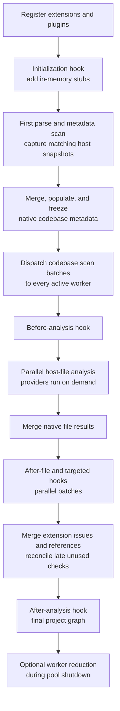

+++
title = "Lifecycle hooks"
description = "Run extension logic before parsing, during codebase scanning, and after analysis."
nav_order = 20
nav_section = "Extensions"
nav_subsection = "Analyzer"
+++
# Lifecycle hooks

Lifecycle hooks observe distinct stages of one analyzer run. Choosing the correct stage matters: available data, parallelism, caching guarantees, and permitted effects differ.

Place lifecycle hook implementations under `src/Mago/Analyzer/Hooks/`, with one class per file.



## Initialization

`InitializationHook::initialize()` runs before Mago parses project source. Its context contains only:

- `phpVersion`;
- `cancellation`;
- `addStub()` and `addMultipleStubs()`.

```php
<?php

declare(strict_types=1);

namespace Acme\Mago\Analyzer\Hooks;

use Mago\Sdk\Analyzer\InitializationContext;
use Mago\Sdk\Analyzer\InitializationHook;

final class FrameworkStubs implements InitializationHook
{
    public function initialize(InitializationContext $context): void
    {
        $context->addStub(
            'acme-extension/container.php',
            '<?php interface AcmeContainer { public function get(string $id): object; }',
        );
    }
}
```

Added stubs exist only in Mago's in-memory source database. Mago parses and scans them for symbols, but never analyzes, lints, formats, or fixes them as project files. Stub filenames must be non-empty, contain no NUL byte, and be unique within the context.

Mago namespaces the logical filename as `@mago-extension/{extension}/{plugin}/{filename}`, escaping unsafe bytes in the extension and plugin path components. Metadata locations expose that final logical name. External stub declarations override vendored and built-in declarations, while project source and configured patch declarations retain higher precedence.

Initialization is broadcast to every active worker in the host pool. Every worker must return identical filenames and bytes; Mago rejects inconsistent stub sets. Replacement workers replay the accepted initialization before serving analyzer requests.

Use stubs for declarations that Mago should understand before it builds metadata. Do not use them as an issue-reporting mechanism or to copy real project files.

## Codebase scanning

`CodebaseScanHook` receives selected host source without asking PHP to parse files again. Mago captures matching snapshots during its first parse and name-resolution pass, then dispatches the completed batches after native metadata has been merged, populated, and frozen.

```php
<?php

declare(strict_types=1);

namespace Acme\Mago\Analyzer\Hooks;

use Mago\Sdk\Analyzer\CodebaseScanContext;
use Mago\Sdk\Analyzer\CodebaseScanHook;

final class RouteScanner implements CodebaseScanHook
{
    public function getTargets(): array
    {
        return ['src/**/*.php', 'routes/*.php'];
    }

    public function scan(CodebaseScanContext $context): void
    {
        if ($context->firstBatch) {
            // Clear data derived during a previous analysis generation.
        }

        foreach ($context->files as $file) {
            // Inspect Mago's SourceFile snapshot.
        }

        if ($context->lastBatch) {
            // Finalize indexes before provider requests begin.
        }
    }
}
```

`getTargets()` returns a non-empty list of path or glob patterns. Patterns containing `*`, `?`, `[`, or `{` use Mago's default glob settings. Other values are exact logical paths or directory prefixes: `src` matches both `src` and paths below `src/`. Only UTF-8 logical paths for host files are eligible; dependencies and in-memory stubs are excluded.

Each batch contains complete syntax, decoded literals, resolved names, the selected `SourceFile` values, and `firstBatch`/`lastBatch` markers. Files are delivered in deterministic path order and split to respect protocol payload limits. Every active worker receives the complete scan sequence, and workers started or restarted later replay it, so every process can construct equivalent local state before providers run. Even an empty match produces one batch with both markers set.

Do not request every PHP file unless every file is genuinely relevant. Narrow scan targets are one of the most important extension performance controls.

## Before analysis

Every before-analysis hook registered by an enabled plugin runs once before parallel file analysis. At this point the merged codebase metadata is complete and read-only.

`BeforeAnalysisContext` provides:

- the common lifecycle services: `phpVersion`, `codebase`, `types`, `cancellation`, and `report()`;
- `references`, a project-wide `ReferenceRegistry` for framework-known symbol references.

This stage is appropriate for validating a framework model built during codebase scanning, reporting project-level setup problems, and registering references that are not owned by one analyzed file. It cannot add or replace codebase symbols; declarations must be supplied as initialization stubs.

## After each file

`AfterFileAnalysisHook` observes one completed file. In a full project run, Mago first merges all native file results, then dispatches after-file and targeted hooks in parallel lifecycle batches. The hook is therefore per-file in data, not an inline step inside that file's native analysis:

```php
<?php

declare(strict_types=1);

namespace Acme\Mago\Analyzer\Hooks;

use Mago\Sdk\Analyzer\AfterFileAnalysisContext;
use Mago\Sdk\Analyzer\AfterFileAnalysisHook;

final class FileMetrics implements AfterFileAnalysisHook
{
    public function getRequirements(): array
    {
        return [];
    }

    public function afterFileAnalysis(AfterFileAnalysisContext $context): void
    {
        foreach ($context->analysis->getAllExpressionTypes() as $expression) {
            // Collect type-coverage information through one lazy request.
        }
    }
}
```

The context contains the file's `FileAnalysis` and a file-scoped `ReferenceRegistry`. When a file is reanalyzed, Mago replaces that file's previous extension-contributed references rather than accumulating duplicates.

For a plain after-file hook, `getRequirements()` currently recognizes one value:

| Requirement | Embedded data |
| :--- | :--- |
| `ExpressionTypes` | Every expression type in the file |

The other `FileAnalysisRequirement` cases configure [targeted analysis hooks](/extensions/analyzer/targeted-analysis-hooks/); returning them from only an after-file hook does not add targeted data. Without embedded expression types, the hook can still use `FileAnalysis`'s lazy query methods, including `getSourceFile()` for a complete source snapshot.

## After the project

Mago sends one after-analysis callback per enabled plugin that registered at least one `AfterAnalysisHook`, after all file results and symbol references have been merged. That callback invokes every after-analysis hook registered by the plugin once. Its `ProjectAnalysis` exposes:

- per-file analysis summaries and lazy file lookups;
- the merged issue count captured before any after-analysis callback issues are added;
- the final merged `SymbolReferences` graph.

This is the right place for project-wide checks such as unused framework declarations or type-coverage summaries. It may report new issues, but cannot retroactively alter types inferred during file analysis.

## Shared lifecycle services

Before-, after-file, targeted-analysis, and after-analysis contexts extend `LifecycleContext`:

| Member | Purpose |
| :--- | :--- |
| `phpVersion` | PHP language version selected by Mago |
| `codebase` | Lazy, read-only metadata facade for the current analysis generation |
| `types` | Native, codebase-aware type comparison service |
| `cancellation` | Cooperative cancellation token |
| `report(Level, code, Issue)` | Reports an issue using a plugin-local code; Mago prefixes the plugin identifier |

The codebase is frozen before scan callbacks and parallel analysis are dispatched. Immutable metadata and comparison responses may therefore be cached for that generation. SDK facades already cache supported lazy queries, including missing lookup results where applicable.

## State and worker identity

Hooks run inside worker processes. PHP object state is local to one worker and is not automatically shared with other workers. Use codebase scan broadcasts to build equivalent read-only indexes in every worker. If state must be combined after all work is done for an external side effect, implement a [worker reducer](/extensions/sdk/worker-reduction/).
