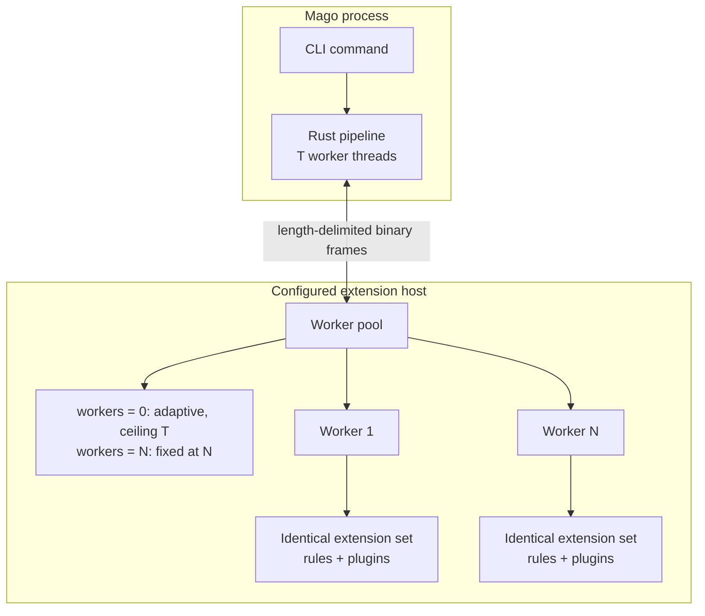
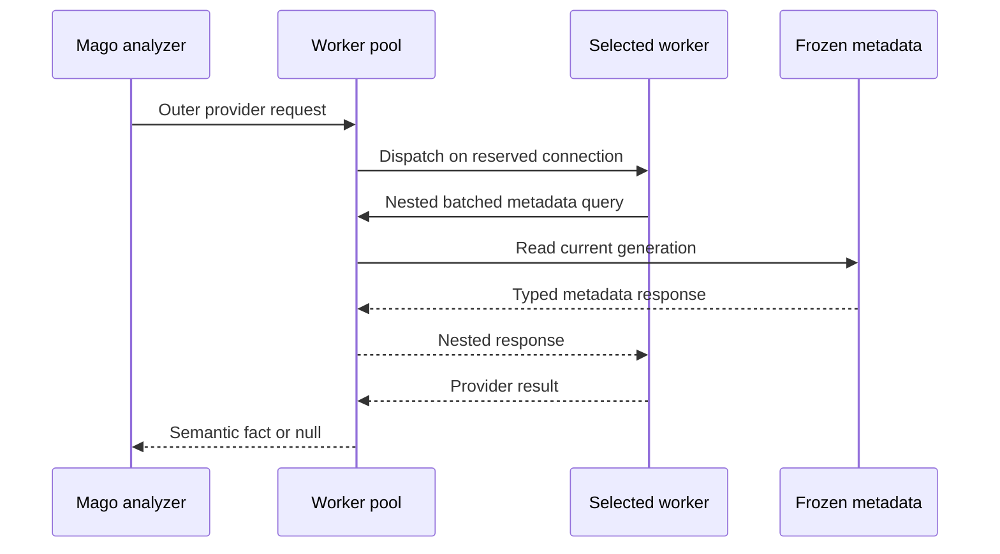

+++
title = "Architecture and execution model"
description = "How Mago schedules extension workers, exchanges data, and orders extension callbacks."
nav_order = 40
nav_section = "Extensions"
+++
# Architecture and execution model

Mago keeps parsing, target matching, scheduling, and analysis in Rust. External workers receive compact, capability-specific views and return explicit results. This preserves Mago's parallel pipeline while allowing framework knowledge to live in extensions written in any language.

## Hosts, workers, and logical extensions

The three terms have distinct meanings:

- A **host** is one `[extension-hosts.NAME]` configuration entry and its command.
- A **worker** is one command-scoped process started from that command.
- An **extension** is one logical bundle of rules and plugins advertised by every worker in the pool. The PHP SDK represents it as `Mago\Sdk\Extension`.

One worker may host multiple extensions. Every worker in a pool must construct equivalent extensions, rules, plugins, targets, and capabilities.

## Registration

Each command starts the enabled hosts it needs. The linter registration exchange describes extension identity, linter rule definitions, and worker-reduction support. `mago analyze` performs a separate analyzer registration exchange for extension identity, plugin definitions, targets, data requirements, and worker-reduction support.

Mago rejects conflicting or inconsistent registration before the corresponding lint or semantic-analysis work is dispatched. Adaptive workers started later replay the successful bootstrap exchanges before serving ordinary requests.

Use `mago extension validate` to validate host startup and linter registration without linting files. Analyzer registration and plugin selection are exercised by `mago analyze`.

## Transport

Requests and responses use length-delimited binary frames with request identifiers, nesting information, cancellation, and error responses. Standard output belongs exclusively to this protocol. The PHP SDK captures buffered accidental output and redirects throwable details to standard error, but extensions should never print to protocol output.

On Unix-like systems, Mago uses process pipes. The bundled PHP SDK uses an authenticated loopback input transport on Windows because redirected PHP standard input cannot reliably support the required non-blocking behavior. This is handled by `Worker::run()`; another SDK may choose an equivalent compatible transport implementation.

The versioned binary protocol is the language-neutral extension ABI. The bundled PHP SDK is its first-party implementation. PHP authors should use the SDK classes shipped with the installed Mago version; authors of another SDK must implement the same frame and capability contracts.

## Scheduling and parallelism

Mago reserves the least-loaded available worker for ordinary requests. Analyzer requests may use a file-derived affinity key to break ties among equally loaded workers, improving process-local cache locality without sacrificing throughput.

A worker pool provides parallelism by running multiple processes. CPU-bound work within one worker follows that language runtime's own execution model.

In the PHP SDK, Fibers provide concurrency rather than CPU parallelism, so CPU-bound callbacks in one process execute sequentially. Each request runs in a Fiber, allowing extension code using cooperative Revolt I/O to let another in-flight request progress.

With `workers = 0`, an adaptive pool starts at the smaller of three processes and Mago's configured thread count. It may grow to that thread count when sustained request contention and observed callback time justify more processes. An analyzer host with parallel after-file or targeted work may proactively reach half of that capacity, rounded up. A positive `workers` value creates a fixed pool and starts exactly that many processes immediately, even when the value exceeds Mago's thread count.

## Data minimization

Mago does not send every source file or its complete syntax tree by default.

- Linter rules declare `NodeKind` targets. Mago sends only files with active targets and only the syntax subtrees needed by those rules.
- Codebase-scan hooks declare path targets. Only matching host files are included.
- Targeted analyzer hooks declare node, method, or class-like targets plus explicit data requirements.
- Metadata and type comparisons use nested requests, with batched SDK methods available to avoid repeated round trips.

This target-first design is part of the public performance contract: extension authors describe what they need, and Mago performs broad matching in Rust.

## Analyzer lifecycle

Initialization is the only phase that can add source stubs. Once the codebase is frozen, hooks receive a read-only `Codebase` facade. Providers participate during ordinary expression analysis. After-file hooks and targeted analysis hooks receive completed file artifacts. The after-analysis hook receives the merged project result.

See [Lifecycle hooks](/extensions/analyzer/lifecycle-hooks/) for the complete interactive lifecycle map and the data available at every stage.

## Nested requests

An analyzer callback can query Mago while its outer request is active. The worker emits a nested request, and Mago answers it using the current immutable analysis generation. Nested services include codebase metadata lookup, type comparison, per-file analysis-artifact lookup, and symbol-reference lookup.

The SDK caches immutable metadata within an analysis generation where safe. Prefer `getMultiple*`, `checkMultiple*`, and batch-comparison methods whenever the complete set of keys is already known.

## Failure behavior

Mago distinguishes optional semantic hints from lifecycle operations:

- A failed optional provider is logged and native analysis continues with its original type, signature, assertion, or initialization knowledge.
- Registration, initialization, codebase-scan, and lifecycle callback failures fail the current operation.
- A timed-out or disconnected worker may be restarted. Successful bootstrap state is replayed before the replacement serves requests.
- Cancellation is cooperative inside workers. With the PHP SDK, long loops should periodically call `throwIfCancelled()`.

Worker exceptions are serialized as error responses and include the retained standard-error tail in Mago's diagnostics where applicable.

## Shutdown and reduction

If no extension registers a `WorkerReducer`, shutdown sends no reduction requests. Otherwise Mago collects from every active worker concurrently, preserves responses in worker-index order, shuts down every worker except worker 0, sends the ordered batch to worker 0's reducers, and finally shuts down worker 0. Reduction is for extension-owned terminal work, not for adding Mago diagnostics after analysis.

See [Worker state and reduction](/extensions/sdk/worker-reduction/) for the API and guarantees.
