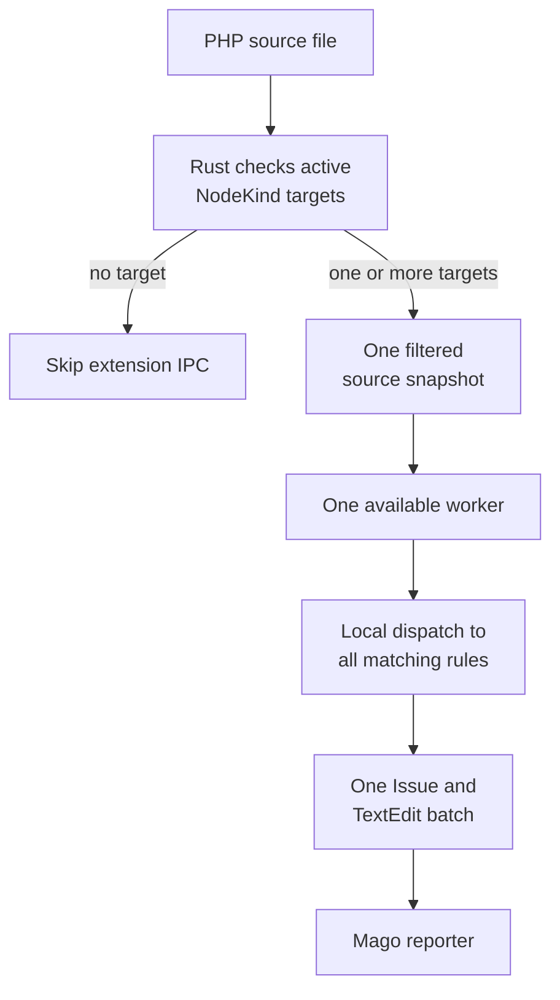

+++
title = "Linter extensions"
description = "How custom PHP linter rules fit into Mago's native lint pipeline."
nav_order = 10
nav_section = "Extensions"
nav_subsection = "Linter"
+++
# Linter extensions

A custom linter rule inspects syntax. It does not receive inferred analyzer types or whole-codebase metadata. Use an [analyzer plugin](/extensions/analyzer/overview/) when a decision depends on semantic types, inheritance, or cross-file references.

## Execution model

Each rule declares one or more `NodeKind` targets. For every file, Mago:

1. determines which external rules are active;
2. checks in Rust whether the file contains any requested node kinds;
3. builds one filtered source snapshot for the active rules in that host;
4. sends the snapshot to one worker;
5. asks the worker to invoke its matching rules locally for each target node;
6. returns all reported issues in one response.

There is no IPC round trip per syntax node. Mago sends one request per matching file and host, and the worker dispatches all matching rules in memory.

The filtered snapshot retains each outermost matching target with its complete syntax subtree. A nested matching node is marked as another target inside that retained subtree rather than encoded twice. Unrelated ancestors and subtrees are omitted. The snapshot still carries the file's complete in-memory source bytes and all comment trivia; resolved names are limited to retained target ranges, and decoded literal-string values are not included.



## Activation

`RuleDefinition::$defaultEnabled` controls normal `mago lint` activation. `mago lint --only vendor/rule-code` selects an external rule explicitly regardless of its default.

Use the extension command to inspect external rules:

```sh
mago extension list
mago extension list --json
```

The built-in `mago lint --list-rules` and `--explain` registry currently describe native rules. External rule descriptions are advertised through `mago extension list`.

External rule-specific configuration beyond selection and registration defaults is not currently passed to PHP callbacks. Put extension options in the worker entrypoint or extension factory:

```php
(new Worker(
    AcmeExtension::create(requireFinalServices: true),
))->run();
```

## Appropriate rules

Good linter rules can decide from source structure, comments, resolved names, and literal source text. Examples include:

- banning a project-specific function or attribute;
- enforcing a framework declaration convention;
- replacing a known helper call with a preferred equivalent;
- validating a local naming or modifier pattern.

Rules should not scan unrelated files, parse Composer metadata for every node, or reproduce type inference. Move those concerns to initialization state or an analyzer plugin.

## Failures

An exception from a linter rule fails the file request and identifies the rule code. Unlike optional analyzer providers, linter rules have no meaningful native fallback for their own diagnostic behavior. Check cancellation in expensive loops and test rules against malformed syntax.

Continue with [Writing linter rules](/extensions/linter/rules/).
