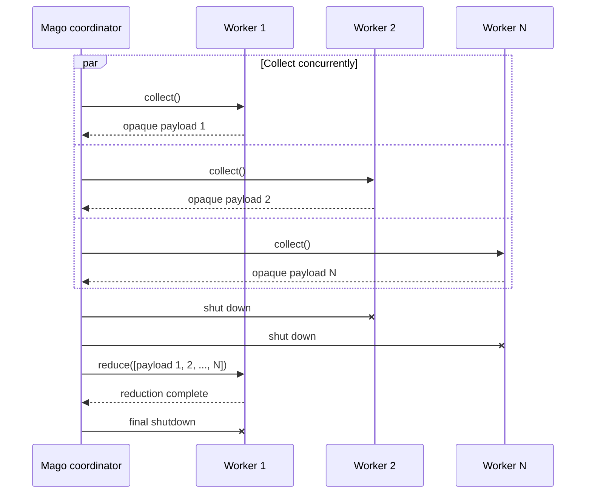

+++
title = "Worker state and reduction"
description = "Merge process-local extension data when a worker pool shuts down."
nav_order = 40
nav_section = "Extensions"
nav_subsection = "PHP SDK"
+++
# Worker state and reduction

Each PHP process has independent memory. `WorkerReducer` lets an extension collect one opaque payload per worker and perform terminal work with the complete ordered set.

Use reduction for extension-owned output such as metrics, indexes, or a single API upload. It is not an analyzer hook and cannot add diagnostics to a completed Mago result.

## Implement a reducer

Place worker-level support such as reducers under `src/Mago/Worker/`:

```php
<?php

declare(strict_types=1);

namespace Acme\Mago\Worker;

use Mago\Sdk\WorkerReducer;
use Mago\Sdk\WorkerReductionContext;

final class CoverageReducer implements WorkerReducer
{
    /** @var array<string, int> */
    private array $covered = [];

    public function record(string $file, int $expressions): void
    {
        $this->covered[$file] = $expressions;
    }

    public function collect(): string
    {
        return json_encode($this->covered, JSON_THROW_ON_ERROR);
    }

    public function reduce(WorkerReductionContext $context): void
    {
        $merged = [];
        foreach ($context->workerPayloads as $payload) {
            $context->cancellation->throwIfCancelled();
            foreach (json_decode($payload, true, flags: JSON_THROW_ON_ERROR) as $file => $count) {
                $merged[$file] = $count;
            }
        }

        file_put_contents('build/type-coverage.json', json_encode($merged, JSON_THROW_ON_ERROR));
    }
}
```

The payload is an opaque byte string to Mago. JSON is convenient, not required; extensions may use a compact binary representation.

## Share the reducer with callbacks

Construct one reducer object and pass the same instance to rules or plugins that record data:

```php
$coverage = new CoverageReducer();

new Extension(
    identifier: 'acme/coverage',
    name: 'Acme type coverage',
    version: '1.0.0',
    analyzerPlugins: [new CoveragePlugin($coverage)],
    workerReducer: $coverage,
);
```

The object is shared only within one process. Each worker constructs its own equivalent object graph.

## Shutdown sequence

When reduction is registered, Mago:



1. stops accepting ordinary work for the pool;
2. calls `collect()` on all active workers concurrently;
3. preserves the collection responses in stable worker-index order;
4. validates that workers advertised the same reducer registrations;
5. keeps worker 0 alive, shuts down the followers, and sends worker 0 the complete batch;
6. calls `reduce()` for each extension reducer on that surviving worker;
7. shuts down worker 0.

`WorkerReductionContext::$workerPayloads` is therefore a non-empty list. It includes the surviving worker's own payload. The order is stable but should not be interpreted as source-file order.

Reduction is enabled only for pools advertising at least one reducer, so ordinary extensions pay no collection or reduction request cost.

## Failure and cancellation

Both methods may throw. A collection or reduction failure is logged as a worker-reduction warning; it does not replace the completed lint or analysis result. Mago still proceeds with process cleanup.

The reduction context contains a cancellation token. Check it before expensive decoding, network activity, or filesystem work. Both `collect()` and `reduce()` use the host's `request-timeout-ms`. The separate `shutdown-timeout-ms` is only the grace period between sending the shutdown frame and forcibly terminating a process.

## Design guidance

- Keep `collect()` deterministic and fast; it runs once in every active worker.
- Send the minimum state required for the final operation.
- Bound payload sizes. The complete reduction request must fit the host's `maximum-payload-size`.
- Make externally visible reduction effects idempotent when possible.
- Do not depend on reduction for correctness of Mago's reported analysis.
